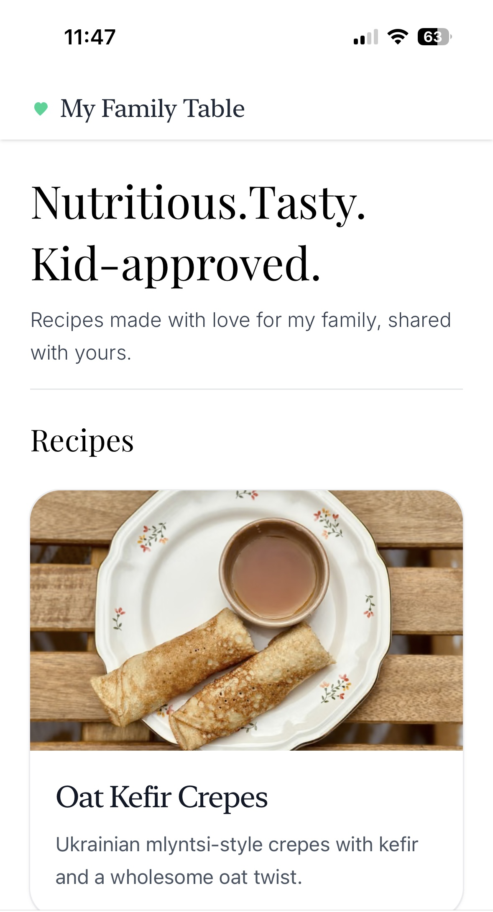
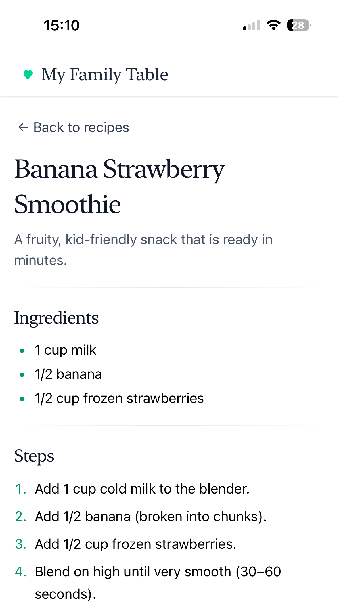

#  My Family Table 

**Nutritious. Tasty. Kid-approved.**  
A clean, ad-free recipe website for families: built with **Angular 20** & **NestJS**.

🔗 Live demo: [https://myfamilytable.app](https://myfamilytable.app)

---

## 💡 Vision

Most recipe websites are cluttered with ads, slow, and frustrating to use.  
**My Family Table** is designed to be:

- **clean** (no clutter, no ads)  
- **family-friendly** (recipes kids actually enjoy)  
- **smart** (AI search by ingredients, coming soon).  

✨ *Built during my return to tech after a long maternity break, inspired by my daughter’s strong character and our kitchen experiments together.*  
✨ *Every recipe on the site is one I actually cooked for my partner and child — it’s a family project as much as a portfolio piece.*

---

## 📸 Preview

  
  

---

## ✨ Features

### ✅ Shipped
- **Angular 20** frontend with **Tailwind CSS v4** (base UI), deployed on **Vercel**
- **Custom domain + SSL** → [https://myfamilytable.app](https://myfamilytable.app)
- **NestJS API backend** (CORS/Helmet, hosted on **Render**)
- **Database integration**: Neon Postgres + Prisma (Recipes table with migrations & seeding)
- **Live recipe cards** rendered from seeded DB via API + Angular mapping layer
- **Image pipeline**: Cloudinary (public IDs in DB, transformed on the fly for UI)
- **Recipe Detail Page** → routing, DTOs, and basic template with ingredients, steps, and tips 

### 🚧 In Progress
- **Recipe List polish** → error & empty states  
- **Cloudinary integration** → proper alt text, graceful fallbacks/placeholders  
- **Prisma/DB workflow** → improving migrations & deploy scripts for dev/prod parity  

### 🔜 Planned
- **“What’s in my fridge?” search** → enter ingredients, get AI-ranked recipes  
- **Accessibility & SEO** → focus styles, semantic markup, Angular Universal SSR  
- **Design polish** → footer, icons, playful but minimal styling

---

## 🛠️ Tech Stack

- **Frontend:** Angular 20 (Standalone Components, Signals, Tailwind v4)  
- **Backend:** NestJS 11 (REST API, validation, Helmet, CORS)  
- **Database:** Neon Postgres (cloud-hosted) with Prisma ORM (migrations & seeding)  
- **Assets:** Cloudinary (image storage + transformation)  
- **Language:** TypeScript (Node.js 20)  
- **Tooling:** ESLint, Prettier (consistent style & formatting)  
- **Hosting/Deployment:** Vercel (frontend) + Render (backend)  

