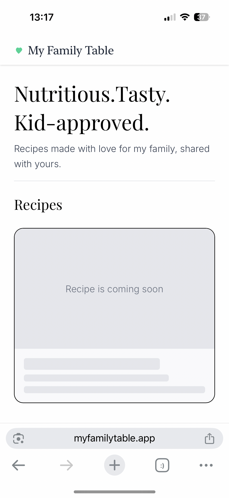

# 🍽️ My Family Table

**Nutritious. Tasty. Kid-approved.**  
A clean, ad-free recipe website for families, built with **Angular 20** and **NestJS**.  

🔗 Live demo: [https://myfamilytable.app](https://myfamilytable.app)

---

## 💡 Vision

Most recipe websites are cluttered with ads, slow, and frustrating to use.  
**My Family Table** is designed to be:

- **clean** (no clutter, no ads)  
- **family-friendly** (recipes kids actually enjoy)  
- **smart** (AI search by ingredients, coming soon).  

✨ *Built during my return to tech after a long maternity break, inspired by my daughter’s strong character and our joyful kitchen experiments together.*  

---

## 📸 Preview

---

## ✨ Features

### ✅ Shipped
- **Angular 20** frontend with **Tailwind CSS v4** (base UI), deployed on **Vercel**
- **Custom domain + SSL** → [https://myfamilytable.app](https://myfamilytable.app)
- **NestJS API backend** (CORS/Helmet, hosted on **Render**)

### 🚧 In Progress
- **Recipe List (core)**: responsive card grid + loading skeletons + error/empty states
- **Design polish**: header/footer, accessible focus styles, icons

### 🔜 Planned
- **Recipe Detail Page** (ingredients, steps, kid tips)
- **“What’s in my fridge?”** ingredient search (client filter → API → AI rerank)

---

## 🛠️ Tech Stack

- **Frontend:** Angular 20 (Standalone Components, Signals, Tailwind v4)  
- **Backend:** NestJS (API under development)  
- **Language:** TypeScript (Node.js 20)  
- **Styling/Formatting:** Prettier, ESLint  
- **Hosting:** Vercel (frontend), Render (backend)

